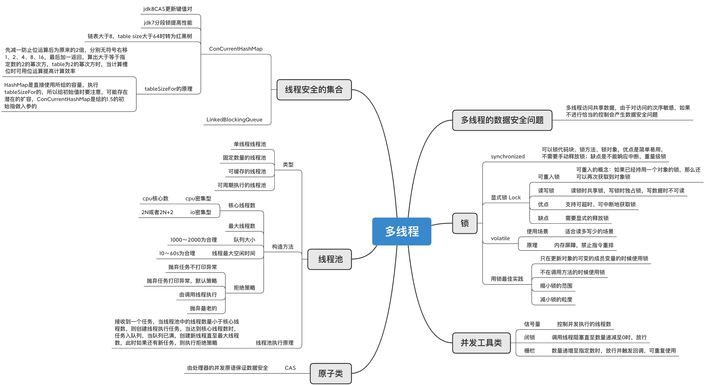

**学习笔记**
---------------------------
#### 作业一 思考有多少种方式，在main函数启动一个新线程，运行一个方法，拿到这个方法的返回值后，退出主线程?
思路：<br>
1. 使用Runnable接口,线程执行结束后，将结果存放在主线程的静态变量里<br>
2. 使用Callable接口，future.get()阻塞获取执行结果<br>
3. 使用CountDownLatch，在主线程中await<br>
4. 使用CyclicBarrier，在执行线程中await<br>
5. 使用join，在主线程中汇合<br>
6. 使用Object的wait方法<br>

代码实现：<br>
1. 使用Runnable接口,线程执行结束后，将结果存放在主线程的静态变量里
```java
import java.util.concurrent.ExecutorService;
import java.util.concurrent.Executors;
import java.util.concurrent.TimeUnit;

public class RunnableDemo {
    static Integer result;

    public static void main(String[] args) throws Exception {
        long start = System.currentTimeMillis();
        // 在这里创建一个线程或线程池，
        ExecutorService service = Executors.newSingleThreadExecutor();
        // 异步执行 下面方法
        service.execute(() -> result = sum());

        //这是得到的返回值
        while (true) {
            if (result == null) {
                TimeUnit.MILLISECONDS.sleep(100);
            } else {
                break;
            }
        }
        // 确保  拿到result 并输出
        System.out.println("异步计算结果为：" + result);

        System.out.println("使用时间：" + (System.currentTimeMillis() - start) + " ms");

        // 然后退出main线程
        service.shutdown();
    }

    private static int sum() {
        return fibo(36);
    }

    private static int fibo(int a) {
        if (a < 2) {
            return 1;
        }
        return fibo(a - 1) + fibo(a - 2);
    }
}
```
---------------------------
2. 使用Callable接口，future.get()阻塞获取执行结果
```java
import java.util.concurrent.ExecutionException;
import java.util.concurrent.ExecutorService;
import java.util.concurrent.Executors;
import java.util.concurrent.Future;

public class CallableDemo {
    public static void main(String[] args) {
        long start = System.currentTimeMillis();
        // 在这里创建一个线程或线程池，
        ExecutorService service = Executors.newSingleThreadExecutor();
        // 异步执行 下面方法
        Future<Integer> future= service.submit(CallableDemo::sum);

        //这是得到的返回值
        int result = 0;
        try {
            result = future.get();
        } catch (InterruptedException e) {
            e.printStackTrace();
        } catch (ExecutionException e) {
            future.cancel(true);
        }

        // 确保  拿到result 并输出
        System.out.println("异步计算结果为：" + result);

        System.out.println("使用时间：" + (System.currentTimeMillis() - start) + " ms");

        // 然后退出main线程
        service.shutdown();
    }

    private static int sum() {
        return fibo(36);
    }

    private static int fibo(int a) {
        if (a < 2) {
            return 1;
        }
        return fibo(a - 1) + fibo(a - 2);
    }
}
```
------------------
3. 使用CountDownLatch，在主线程中await
```java
import java.util.concurrent.CountDownLatch;
import java.util.concurrent.ExecutorService;
import java.util.concurrent.Executors;

public class CountDownLatchDemo {
    static Integer result;
    static CountDownLatch latch = new CountDownLatch(1);

    public static void main(String[] args) throws Exception{
        long start = System.currentTimeMillis();
        // 在这里创建一个线程或线程池，
        ExecutorService service = Executors.newSingleThreadExecutor();
        // 异步执行 下面方法
        service.execute(() -> {
            //这是得到的返回值
            result = sum();
            latch.countDown();
        });
        
        latch.await();

        // 确保  拿到result 并输出
        System.out.println("异步计算结果为：" + result);

        System.out.println("使用时间：" + (System.currentTimeMillis() - start) + " ms");

        // 然后退出main线程
        service.shutdown();
    }

    private static int sum() {
        return fibo(36);
    }

    private static int fibo(int a) {
        if (a < 2) {
            return 1;
        }
        return fibo(a - 1) + fibo(a - 2);
    }
}
```
----------------------
4. 使用CyclicBarrier，在执行线程中await
```java
import java.util.concurrent.BrokenBarrierException;
import java.util.concurrent.CyclicBarrier;
import java.util.concurrent.ExecutorService;
import java.util.concurrent.Executors;

public class CyclicBarrierDemo {
    static Integer result;
    static CyclicBarrier cyclicBarrier = new CyclicBarrier(1, () -> {
        // 确保  拿到result 并输出
        System.out.println("异步计算结果为：" + result);

    });

    public static void main(String[] args) throws Exception {
        long start = System.currentTimeMillis();
        // 在这里创建一个线程或线程池，
        ExecutorService service = Executors.newSingleThreadExecutor();
        // 异步执行 下面方法
        service.execute(() -> {
            //这是得到的返回值
            result = sum();
            try {
                cyclicBarrier.await();
            } catch (InterruptedException e) {
                e.printStackTrace();
            } catch (BrokenBarrierException e) {
                e.printStackTrace();
            }
        });
        
        System.out.println("使用时间：" + (System.currentTimeMillis() - start) + " ms");

        // 然后退出main线程
        service.shutdown();
    }

    private static int sum() {
        return fibo(36);
    }

    private static int fibo(int a) {
        if (a < 2) {
            return 1;
        }
        return fibo(a - 1) + fibo(a - 2);
    }
}
```
----------------------

5. 使用join，在主线程中汇合

```java
public class JoinDemo {

    static Integer result;

    public static void main(String[] args) throws Exception {
        long start = System.currentTimeMillis();
        // 在这里创建一个线程或线程池
        Thread t = new Thread(() -> {
            // 异步执行 下面方法
            result = sum();

        });
        t.start();
        t.join();

        // 确保  拿到result 并输出
        System.out.println("异步计算结果为：" + result);

        System.out.println("使用时间：" + (System.currentTimeMillis() - start) + " ms");

        // 然后退出main线程
    }

    private static int sum() {
        return fibo(36);
    }

    private static int fibo(int a) {
        if (a < 2) {
            return 1;
        }
        return fibo(a - 1) + fibo(a - 2);
    }
}

```
----------------------
6. 使用Object的wait方法

```java
import java.util.concurrent.TimeUnit;

public class WaitDemo {
    static Integer result;
    static Object lock = new Object();

    public static void main(String[] args) throws Exception {
        long start = System.currentTimeMillis();
        // 在这里创建一个线程或线程池
        new Thread(() -> {
            synchronized (lock) {
                // 异步执行 下面方法
                result = sum();
                try {
                    lock.wait();
                } catch (InterruptedException e) {
                    e.printStackTrace();
                }
            }
        }).start();


        TimeUnit.MILLISECONDS.sleep(10);

        synchronized (lock){
            lock.notify();
        }
        // 确保  拿到result 并输出
        System.out.println("异步计算结果为：" + result);

        System.out.println("使用时间：" + (System.currentTimeMillis() - start) + " ms");

        // 然后退出main线程
    }

    private static int sum() {
        return fibo(36);
    }

    private static int fibo(int a) {
        if (a < 2) {
            return 1;
        }
        return fibo(a - 1) + fibo(a - 2);
    }
}

```

#### 作业二 把多线程和并发相关知识梳理一遍，画一个脑图

