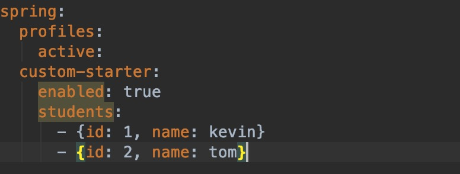

**学习笔记**
------------
#### 作业一 写代码实现spring bean的装配，方式越多越好(XML、Annotation都可以)

思路：<br>
1. 使用@Autowired进行属性的装配
2. 使用set方法进行属性赋值
3. 使用构造方法进行属性赋值
-------------------------
代码实现：
1. 使用@Autowired进行属性的装配
```java
package com.geek.week_05.bean;

import org.springframework.beans.factory.annotation.Autowired;
import org.springframework.stereotype.Component;

@Component
public class A {
    @Autowired
    B b;
}
```
-----------
2. 使用set方法进行属性赋值
```java
package com.geek.week_05.bean;

import org.springframework.beans.factory.annotation.Autowired;
import org.springframework.stereotype.Component;

@Component
public class B {
    C c;

    @Autowired
    public void setC(C c) {
        this.c = c;
    }
}

```
-----------

3. 使用构造方法进行属性赋值
```java
@Component
public class C {
    A a;

    public C(@Autowired A a) {
        this.a = a;
    }
}
```
-----------

#### 作业二 给前面课程提供的 Student/Klass/School 实现自动配置和 Starter
思路：<br>
1. 添加spring.factories文件
2. 添加配置类SpringBootConfiguration
3. 添加获取参数配置类SpringBootPropertiesConfiguration
-----------------------
代码实现：

配置文件如下

--------
获取用户配置
```java
import com.example.springbootstarterdemo.bean.Student;
import lombok.Getter;
import lombok.Setter;
import org.springframework.boot.context.properties.ConfigurationProperties;

import java.util.List;

@Getter
@Setter
@ConfigurationProperties(prefix = "spring.custom-starter")
public class SpringBootPropertiesConfiguration {
    private List<Student> students;
}
```
-----
将Klass/School放入spring容器

```java
import com.example.springbootstarterdemo.bean.Klass;
import com.example.springbootstarterdemo.bean.School;
import com.example.springbootstarterdemo.bean.Student;
import com.example.springbootstarterdemo.prop.SpringBootPropertiesConfiguration;
import org.springframework.beans.factory.annotation.Autowired;
import org.springframework.boot.autoconfigure.condition.ConditionalOnProperty;
import org.springframework.boot.context.properties.EnableConfigurationProperties;
import org.springframework.context.annotation.Bean;
import org.springframework.context.annotation.Configuration;

import java.util.List;

@Configuration
@EnableConfigurationProperties(SpringBootPropertiesConfiguration.class)
@ConditionalOnProperty(prefix = "spring.custom-starter", name = "enabled", havingValue = "true", matchIfMissing = true)
public class SpringBootConfiguration {
    @Autowired
    SpringBootPropertiesConfiguration configuration;

    @Bean
    public Klass klass() {
        List<Student> students = configuration.getStudents();
        Klass klass = new Klass();
        klass.setStudents(students);
        return klass;
    }

    @Bean
    @Autowired
    public School school(Klass klass) {
        School school = new School();
        school.setClass1(klass);
        return school;
    }
}
```
#### 作业三 研究一下 JDBC 接口和数据库连接池，掌握它们的设计和用法


1）使用 JDBC 原生接口，实现数据库的增删改查操作。<br>
```java
import java.sql.*;

public class JdbcDemo {
    public static void main(String[] args) throws Exception {
        Class.forName("com.mysql.cj.jdbc.Driver");
        Connection connection = DriverManager.getConnection("jdbc:mysql://127.0.0.1:3306/test", "root", "123456");

        // 查询
        String query = "select * from user";
        Statement statement = connection.createStatement();
        ResultSet resultSet = statement.executeQuery(query);
        while (resultSet.next()) {
            String id = resultSet.getString("USER_ID");
            String name = resultSet.getString("USER_NAME");
            System.out.println("USER_ID:" + id + ",USER_NAME:" + name);
        }

        // 新增一条记录
        String insert = "insert into user (USER_ID, USER_NAME, PASSWORD, REAL_NAME) VALUES ('2', 'kevin', '123456', 'wdd')";
        Statement insertStatement = connection.createStatement();
        insertStatement.execute(insert);

        // 修改一条数据
        String update = "update user set PASSWORD = '654321' where USER_NAME = 'kevin'";
        Statement updateStatement = connection.createStatement();
        updateStatement.execute(update);

        // 删除数据
        String delete = "delete from user where USER_NAME = 'kevin'";
        Statement deleteStatement = connection.createStatement();
        deleteStatement.executeUpdate(delete);

        connection.close();
    }
}
```

2）使用事务，PrepareStatement 方式，批处理方式，改进上述操作。<br>
```java
import java.sql.Connection;
import java.sql.DriverManager;
import java.sql.PreparedStatement;
import java.sql.ResultSet;

public class TxDemo {
    public static void main(String[] args) throws Exception {
        Class.forName("com.mysql.cj.jdbc.Driver");
        Connection connection = DriverManager.getConnection("jdbc:mysql://127.0.0.1:3306/test", "root", "123456");
        connection.setAutoCommit(false);

        // 查询
        String query = "select * from user";
        PreparedStatement queryStatement = connection.prepareStatement(query);
        ResultSet resultSet = queryStatement.executeQuery();
        while (resultSet.next()) {
            String id = resultSet.getString("USER_ID");
            String name = resultSet.getString("USER_NAME");
            System.out.println("USER_ID:" + id + ",USER_NAME:" + name);
        }

        // 新增一条记录
        String insert = "insert into user (USER_ID, USER_NAME, PASSWORD, REAL_NAME) VALUES ('2', 'kevin', '123456', 'wdd')";
        PreparedStatement insertStatement = connection.prepareStatement(insert);
        insertStatement.execute();

        // 修改一条数据
        String update = "update user set PASSWORD = '654321' where USER_NAME = 'kevin'";
        PreparedStatement updateStatement = connection.prepareStatement(update);
        updateStatement.execute();

        // 删除数据
        String delete = "delete from user where USER_NAME = 'kevin'";
        PreparedStatement deleteStatement = connection.prepareStatement(delete);
        deleteStatement.executeUpdate();

        connection.commit();
        connection.close();
    }
}
```
3）配置 Hikari 连接池，改进上述操作。提交代码到 Github。<br>
```java
import com.zaxxer.hikari.HikariConfig;
import com.zaxxer.hikari.pool.HikariPool;

import java.sql.PreparedStatement;
import java.sql.ResultSet;

public class HikariDemo {
    public static void main(String[] args) throws Exception {
        HikariConfig config = new HikariConfig();
        config.setJdbcUrl("jdbc:mysql://127.0.0.1:3306/test");
        config.setUsername("root");
        config.setPassword("123456");
        config.setMinimumIdle(10);
        config.setMaximumPoolSize(10);
        config.setPoolName("pool");
        HikariPool pool = new HikariPool(config);

        // 查询
        String query = "select * from user";
        PreparedStatement queryStatement = pool.getConnection().prepareStatement(query);
        ResultSet resultSet = queryStatement.executeQuery();
        while (resultSet.next()) {
            String id = resultSet.getString("USER_ID");
            String name = resultSet.getString("USER_NAME");
            System.out.println("USER_ID:" + id + ",USER_NAME:" + name);
        }

        // 新增一条记录
        String insert = "insert into user (USER_ID, USER_NAME, PASSWORD, REAL_NAME) VALUES ('2', 'kevin', '123456', 'wdd')";
        PreparedStatement insertStatement = pool.getConnection().prepareStatement(insert);
        insertStatement.execute();

        // 修改一条数据
        String update = "update user set PASSWORD = '654321' where USER_NAME = 'kevin'";
        PreparedStatement updateStatement = pool.getConnection().prepareStatement(update);
        updateStatement.execute();

        // 删除数据
        String delete = "delete from user where USER_NAME = 'kevin'";
        PreparedStatement deleteStatement = pool.getConnection().prepareStatement(delete);
        deleteStatement.executeUpdate();

        pool.shutdown();
    }
}
```


